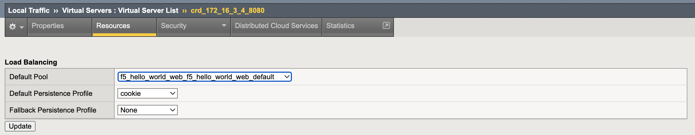

# CIS-static-route integration in OpenShift OVN-Kubernetes implementation:

BIGIP CIS Integration in OCP 4.1x environment with static route and CRD in OpenShift OVN-Kubernetes

Steps to Follow:

1. Install latest AS3 extention on BIG-IP.

  a) Download latest AS3 extention:
  ```
  https://github.com/F5Networks/f5-appsvcs-extension/releases
  ```
  b) Upload package at:  
  BIG-IP iApps  ››  Package Management LX, import and upload downloded file
  
  c) Check installation is Suucessfull
  ```
  https://(IP address of BIG-IP)/mgmt/shared/appsvcs/info
  ```

  Results should be like:
  
  {"version":"3.51.0","release":"5","schemaCurrent":"3.51.0","schemaMinimum":"3.0.0"}

2. Create partition "okd"

# BIGIP CIS Installation manually 

1. Service Account creation:
```
oc create serviceaccount bigip-ctlr -n kube-system
```
2. Elevate Service Account:
```
oc adm policy add-cluster-role-to-user cluster-admin -z bigip-ctlr -n kube-system
```
3. Create secret for BIG-IP admin username and apssword:
```
oc create secret generic bigip-login -n kube-system --from-literal=username= --from-literal=password=<big-ip-admin-password>
```
4. Create clusterrole and clusterrolebinding
```
oc create -f cis-clusterrole.yaml
oc create -f cis-clusterrolebinding.yaml
```
5. Create crds:
```
oc create -f https://raw.githubusercontent.com/F5Networks/k8s-bigip-ctlr/2.x-master/docs/config_examples/customResourceDefinitions/customresourcedefinitions.yml
```
6. Deploy CIS
```
oc create -f cis-deploy.yaml
```
# BIGIP static route should be updated automatically, based OVN 


# Deploy sample Application to and VirtualServer configuration

1. Create sample application deployment:
```
oc create -f sample-app.yaml
```
3. Create service type ClusterIP:
```
oc create -f sample-clusterip-service.yaml
```
5. Create VirtualServer:
```
oc create -f sample-app-vs.yaml
```

# Check BIG-IP configuration crd VS and pool created with default pool assigned to newly created VS:

VS Config:


Pool Config:


Resource assign:




